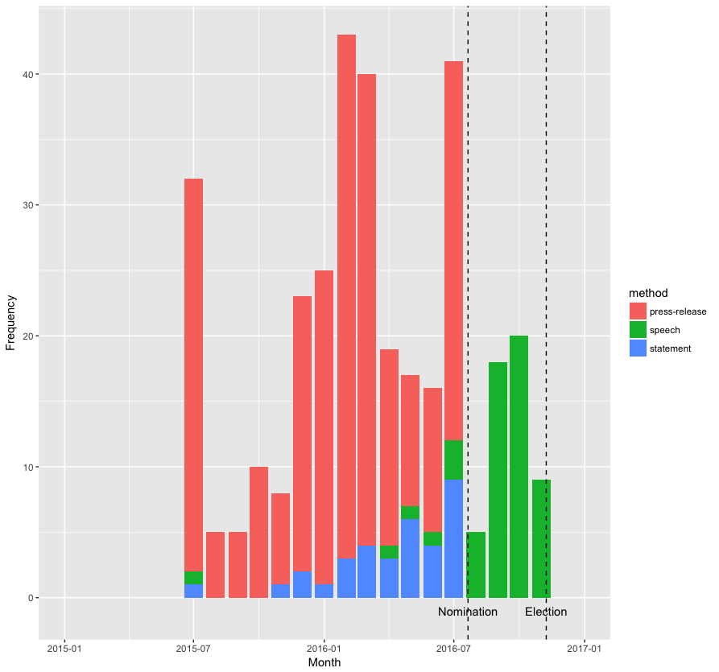

trump-data
==========

Source: http://www.presidency.ucsb.edu/2016_election.php

Each JSON file has three columns:

* date - Date speech / statement / press release was made
* title - Title as given by UCSB
* text - Text of speech stripped of HTML tags

Run
---

First download the data

```
SPEECHES="http://www.presidency.ucsb.edu/2016_election_speeches.php?candidate=45&campaign=2016TRUMP&doctype=5000"
mkdir /tmp/speeches
curl $SPEECHES | OUT=/tmp/speeches ./bin/dl.py
```

Then clean it

```
mkdir -p /tmp/cleaned/speeches
for file in `ls /tmp/speeches`; do
  echo $file
  ./bin/clean.py < /tmp/speeches/$file > /tmp/cleaned/speeches/$file
done
pushd /tmp/cleaned/speeches
rename "s/html/json/" *.html
popd
```

And repeat for any other candidate / content type you want. See: http://www.presidency.ucsb.edu/2016_election.php

Examples
--------

After Trump secured the nomination, the campaign relied only on speeches



Whereas Clinton had a more even distribution of speeches, press releases, and statements


Given that pre-nomination, the Trump campaign showed a more even distribution among these methods, there must have been some perceived or real advantage to switching to entirely speeches.

This shows the lexical dispersion plot for several phrases in all of Trump's speeches concatenated together


The bursty, highly-focused pattern seen with immigration and ISIS might have helped cement opinions on these topics, whose intensity the subsequent steady references could easily recall due to availability bias.

Also, the heavy focus on jobs and trade - which are less abstract than the economy - is interesting, since these things can be felt viscerally (e.g. losing manufacturing jobs to China from outsourcing vs. GDP changing by X%).
