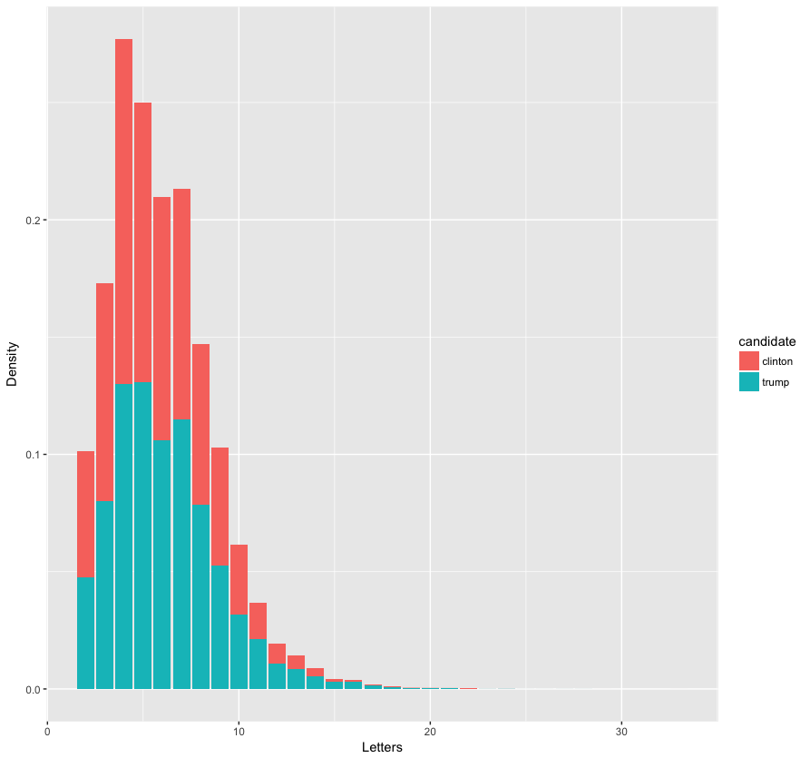

trump-data
==========

Source: http://www.presidency.ucsb.edu/2016_election.php

Each JSON file has three columns:

* date - Date speech / statement / press release was made
* title - Title as given by UCSB
* text - Text of speech stripped of HTML tags

Tweet data prepared using https://github.com/sashaperigo/Trump-Tweets

Run
---

First download the data

```
SPEECHES="http://www.presidency.ucsb.edu/2016_election_speeches.php?candidate=45&campaign=2016TRUMP&doctype=5000"
mkdir /tmp/speeches
curl $SPEECHES | OUT=/tmp/speeches ./bin/dl.py
```

Then clean it

```
mkdir -p /tmp/cleaned/speeches
for file in `ls /tmp/speeches`; do
  echo $file
  ./bin/clean.py < /tmp/speeches/$file > /tmp/cleaned/speeches/$file
done
pushd /tmp/cleaned/speeches
rename "s/html/json/" *.html
popd
```

And repeat for any other candidate / content type you want. See: http://www.presidency.ucsb.edu/2016_election.php

Examples
--------

After Trump secured the nomination, the campaign relied only on speeches


Whereas Clinton had a more even distribution of speeches, press releases, and statements


Given that pre-nomination, the Trump campaign showed a more even distribution among these methods, (with speeches notably underrepresented), there must have been some perceived or real advantage to switching to entirely speeches.

This shows the lexical dispersion plot for several phrases in all of Trump's speeches concatenated together


The bursty, highly-focused pattern seen with immigration and ISIS might have helped cement opinions on these topics, whose intensity the subsequent steady references could easily recall due to availability bias.

Also, the heavy focus on jobs and trade - which are less abstract than the economy - is interesting, since these things can be felt viscerally (e.g. losing manufacturing jobs to China from outsourcing vs. GDP changing by X%).

Maybe most notably, Clinton is mentioned by name with the highest frequency of any of these terms, which suggests a primarily antagonistic approach. 

This has further support in the fact that the distribution of these terms is notably sparse among tweets, with the exception of the names (or nicknames) of rival politicans


Clinton delivered roughly five times as much content in her speeches (525128 words after cleaning, vs. Trump's 106229), and the distribution of the length of each candidate's chosen words was roughly the same



As word length is [at least some measure of complexity](https://langcog.stanford.edu/papers_new/lewis-2015-underrev.pdf), this suggests that both candidates were somewhat calibrated to deliver a message to the same general audience.
